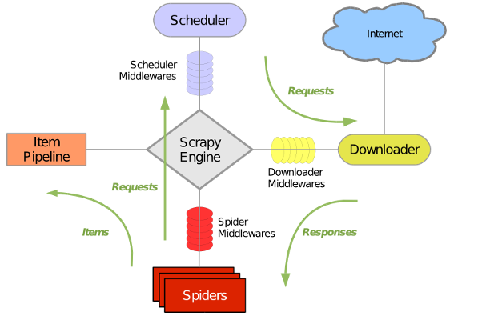
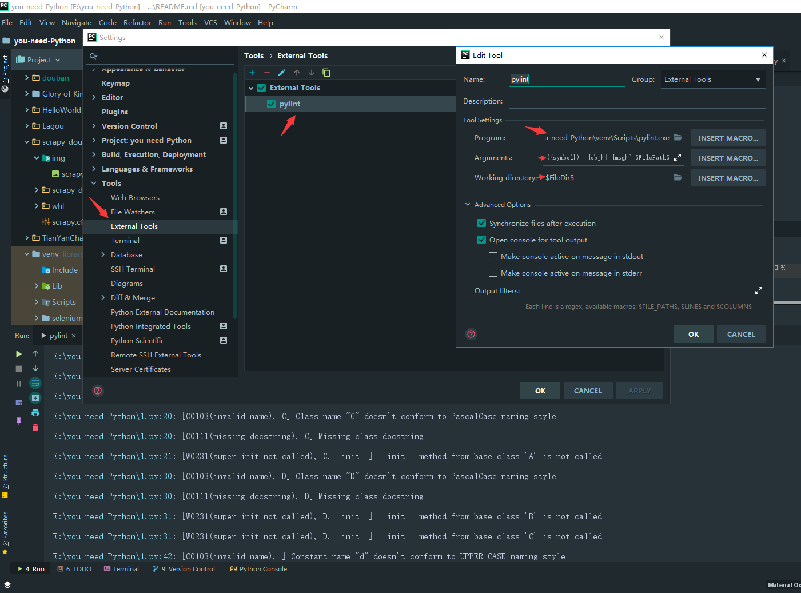

#### you-need-Python@davidvivi

***
[](https://github.com/davidvivi/you-need-Python)
[](https://github.com/davidvivi/you-need-Python)

##### 下载安装
* 下载源码:

```python
git clone https://github.com/davidvivi/you-need-Python.git
或者直接到https://github.com/davidvivi/you-need-Python/tree/develop 下载zip文件
```
* 安装依赖:

```python
pip install -r requirements.txt
```


##### 1、Glory of Kings `王者荣耀各类英雄的出装小技巧`

* 运行环境Python 3.6:

```python
Python 3.6.4 (v3.6.4:d48eceb, Dec 19 2017, 06:54:40) [MSC v.1900 64 bit (AMD64)] on win32
```

* 依赖模块:

```python
from urllib.request import urlretrieve
import requests
import os
```

* 启动:

```python
# 如果你的依赖已经安全完成并且具备运行条件,可以直接在Glory of Kings下运行hero.py
# 到Glory of Kings目录下:
>>>python3 hero.py
```

##### 2、Lagou `Python拉钩数据采集与可视化`

* 注意项-wordcloud的安装:

```python
==== Installation of wordcloud package ====
download wordcloud‑1.3.2‑cp36‑cp36m‑win_amd64.whl from http://www.lfd.uci.edu/~gohlke/pythonlibs/#wordcloud
Copy the file to your current working directory
Open command prompt from Tools
python -m pip install wordcloud-1.3.2-cp36-cp36m-win_amd64.whl
```

* 拉钩数据采集:

```python
# 如果你的依赖已经安全完成并且具备运行条件,可以直接在Lagou下运行lagou.py
>>>python3 hero.py
```
* 数据可视化:

```python
>>>python3 data_analysis.py
```


##### 3、scrapy_doubanmovie `scrapy学习爬取豆瓣电影`

* 注意项-scrapy的安装:

```python
==== Installation of scrapy package ====
利用whl文件安装，先安装Twisted再安装Scrapy
pip install Twisted-18.9.0-cp36-cp36m-win_amd64.whl
pip install Scrapy-1.5.1-py2.py3-none-any.whl
```




* Scrapy组件
    * 引擎(Scrapy):用来处理整个系统的数据流, 触发事务(框架核心)
    * 调度器(Scheduler):用来接受引擎发过来的请求, 压入队列中, 并在引擎再次请求的时候返回. 可以想像成一个URL（抓取网页的网址或者说是链接）的优先队列, 由它来决定下一个要抓取的网址是什么, 同时去除重复的网址
    * 下载器(Downloader):用于下载网页内容, 并将网页内容返回给蜘蛛(Scrapy下载器是建立在twisted这个高效的异步模型上的)
    * 爬虫(Spiders):爬虫是主要干活的, 用于从特定的网页中提取自己需要的信息, 即所谓的实体(Item)。用户也可以从中提取出链接,让Scrapy继续抓取下一个页面
    * 项目管道(Pipeline):负责处理爬虫从网页中抽取的实体，主要的功能是持久化实体、验证实体的有效性、清除不需要的信息。当页面被爬虫解析后，将被发送到项目管道，并经过几个特定的次序处理数据。
    * 下载器中间件(Downloader Middlewares):位于Scrapy引擎和下载器之间的框架，主要是处理Scrapy引擎与下载器之间的请求及响应。
    * 爬虫中间件(Spider Middlewares):介于Scrapy引擎和爬虫之间的框架，主要工作是处理蜘蛛的响应输入和请求输出。
    * 调度中间件(Scheduler Middewares): 介于Scrapy引擎和调度之间的中间件，从Scrapy引擎发送到调度的请求和响应。
* 流程
    1. 引擎从调度器中取出一个链接(URL)用于接下来的抓取
    2. 引擎把URL封装成一个请求(Request)传给下载器
    3. 下载器把资源下载下来，并封装成应答包(Response)
    4. 爬虫解析Response
    5. 解析出实体（Item）,则交给实体管道进行进一步的处理
    6. 解析出的是链接（URL）,则把URL交给调度器等待抓取
    
* pylint在pycharm中的使用
    1. 安装pylint
        pip install pylint

    2. 配置pylint
    pycharm --settings--Tools--External Tools，新建
    
    
##### 4、Flask_news `Flask的简单demo`

* 注意项-flask的安装:
```python
==== Installation of flask package ====
pip install flask
pip install pip install Flask-SQLAlchemy
```

* 创建数据表:
```python
>>>python3 create_table.py
```